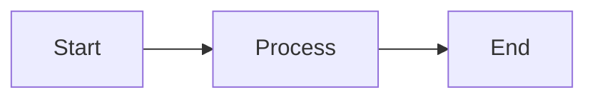

# Example Presentation

A demo of all slide types

* * *

## Bullet Points

- First point with **emphasis**
- Second point shows features
- Third point with more detail

* * *

## Big Quote

<!-- big quote -->

> To change someone's workflow, you need to be **10x better** than what they were doing before

* * *

## Mermaid Diagram

* * *

## Two Column Layout

Left column content:
- Point A
- Point B

Right column content:
- Point C
- Point D

* * *

## Image Slide

* * *

## Vertical Image Gallery

<!-- image gallery - VERTICAL -->
First image caption

Second image caption

* * *

# Thank You

Questions?
